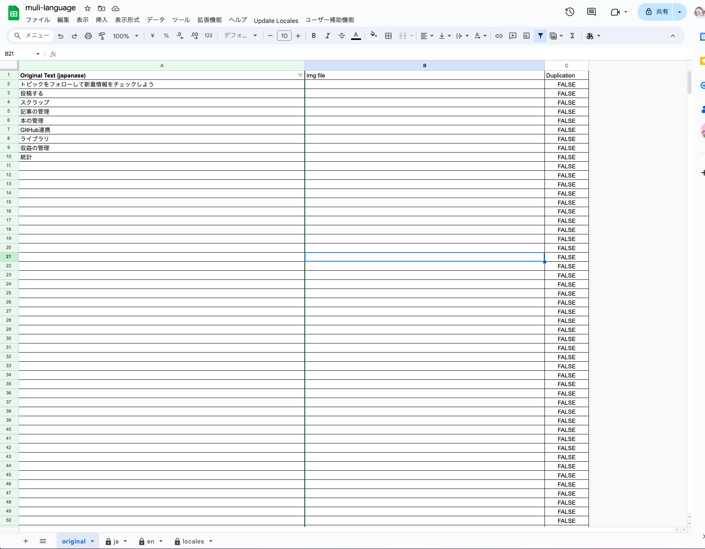
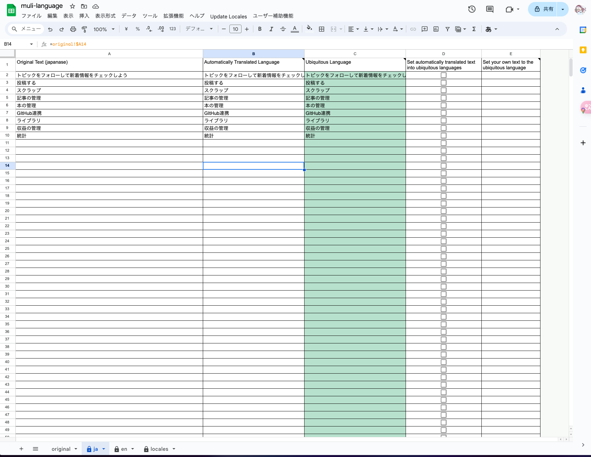
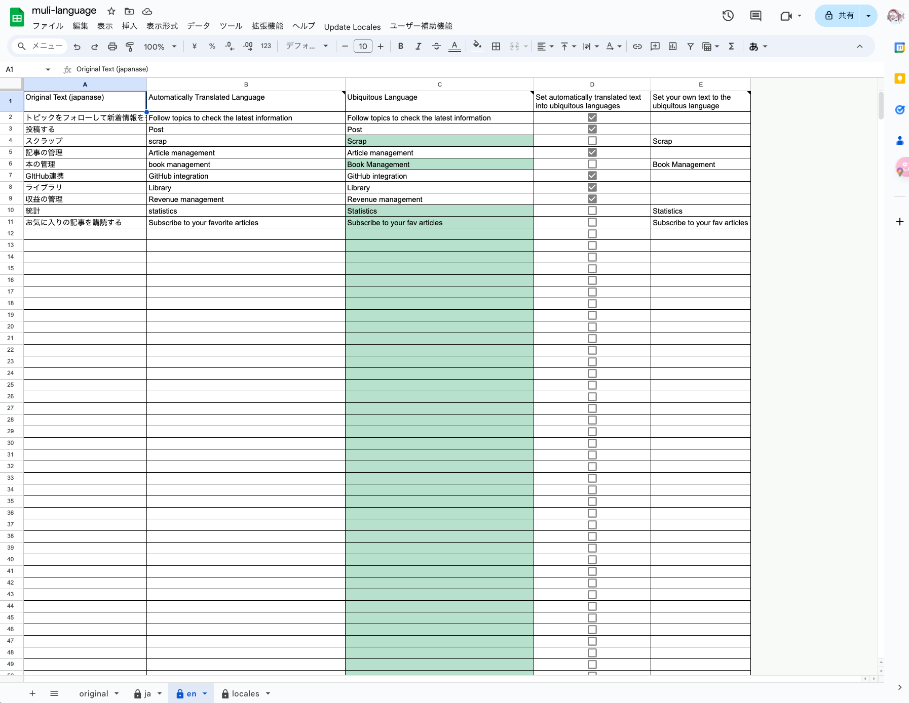
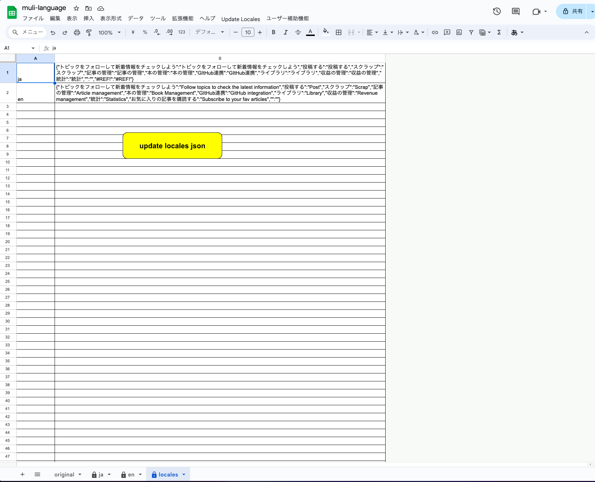
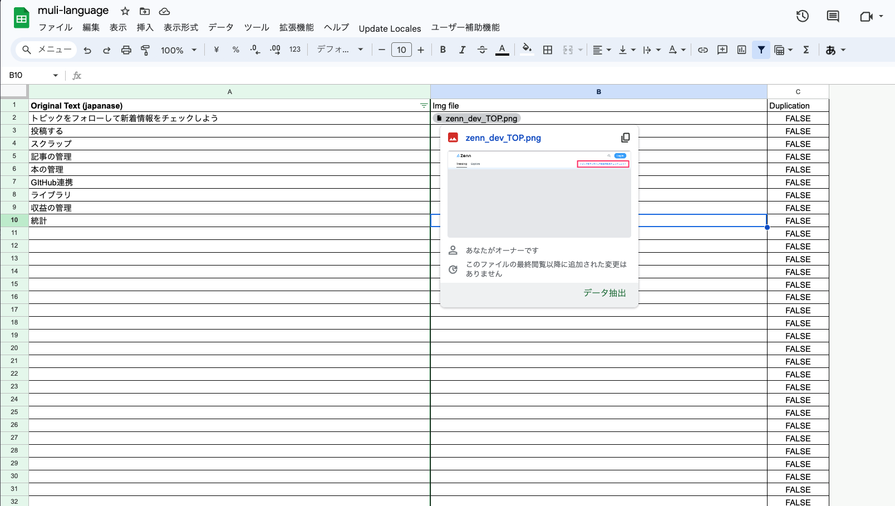
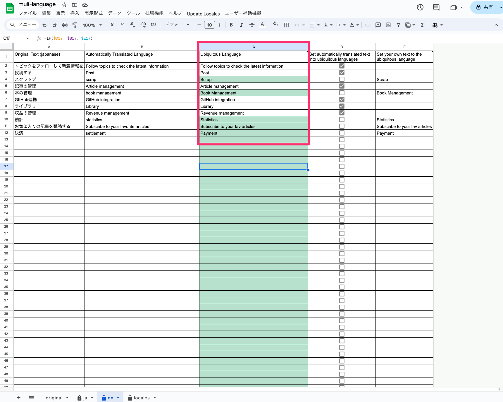

**サービス・システムの多言語化を皆さんどうやっていますか？**

サイトのシステム構成にもよると思いますが、多言語化には色々なベンダーのSaaSや、各種ライブラリ等を使用して実施しているかと思います。
今回の記事では、多言語化するまでの取り組みと、ちょっとモヤモヤする部分の手助けができればと思います。

**この記事で説明すること**

- 多言語化するプロセス
- 多言語化するための翻訳ファイルを生成するプログラムの説明

**この記事で説明しないこと**

- JavaScriptの書き方
- i18nライブラリ等の仕様

**環境など**
- GoogleAppsScript(GAS)

## 痒いところに手が届かない多言語化問題（翻訳）

昨今、AIツールなどで翻訳等も活発化していますが、痒いところに手が届かない感じはありませんか？  
例えば、システム開発を行っていると出てくる問題点は「ユビキタス言語」。  
社内で独自で使用している言葉の言い回しや、チーム内で通じる言葉等があると思います。

このような言語を、直接翻訳ツールに翻訳を実行したときに「思ってたんと違う...」といった事象は少なくないと思います。  
また、チーム内でユビキタス言語を実際にコードに落とし込み、使用している部分があるかと思いますが、その際にも翻訳された言語と微妙にズレているなんてことはないでしょうか？

上記のような問題を、**出来るだけ簡単に無料で対応**していくのが本記事の目的です。  

## 結論： 軽度のプロダクトにおける多言語化ならこうする

- GoogleSpreadSheetは[こちら]()

### シートの説明

- [sheet1: `original`](#sheet1-original)
  - 
- [sheet2: `ja`](#sheet2-ja)
  - 
- [sheet3: `en`](#sheet3-en)
  - 
- [sheet4: `locales`](#sheet4-locales)
  - 

#### sheet1: original

- 日本語のテキストを管理するシート
- プロダクトのどの部分なのかをキャプチャのファイルと一緒に管理し、テキストの意図や文脈を把握するために利用する

基本的には、これをマスターファイルのシートとして利用します。  
画像のファイルをファイルと同じディレクトリに格納しておき、チップ形式でどこの画像なのかをプレビュー形式で表示できるようにしておと便利です。  



実際に格納しておく画像は、以下のようにどこの部分のテキストなのかをわかるようにしておきます。  
目的としては、前後の文脈を理解しやすいようにするためです。

:::message
イメージファイルはあんまり細かくしない方が吉  
出来るだけページごとの方が管理が楽です
:::


#### sheet2: `ja`

- 日本語(ja)の翻訳ファイルとして使用する
- 基本的には前述の`original`シートと内容が被るため、**基本的に編集等も必要ない**

#### sheet3: `en`

- 英語(en)の翻訳ファイルとして使用する
- 自動で翻訳された英語が、文脈に沿った内容になっているのか、ユビキタス言語に沿った翻訳になっているのかを管理する
  - もし、翻訳された内容が意図しないものになっている場合は、自身で編集する

##### 列の解説

具体的には以下のようなシート構成になっています。  
詳しい使用感などはGoogleSpreadSheetを参照してください。

- A列
  - `original`シートのテキストを参照
- B列
  - A列に入力された値を`GOOGLETRANSLATE`関数で自動翻訳
- C列
  - ユビキタス言語となるテキストを入力される（**この列に入力されている値が決定事項として直接翻訳されます**）
- D列
  - 自動翻訳された言語をユビキタス言語とするか、否かをチェックボックスで判定
    - チェックが入った場合、自動翻訳されたテキストをユビキタス言語として登録
    - チェックが入っていない場合、E列に入力されたテキストをユビキタス言語として登録
- E列
  - 独自のユビキタス言語として入力する

| A列(編集しない)                        | B(編集しない)                                 | C(編集しない)                   | D(編集する)                                                           | E(編集する)                                            |
| ------------------------ | --------------------------------- | ------------------- | ----------------------------------------------------------- | -------------------------------------------- |
| Original Text (japanase) | Automatically Translated Language | Ubiquitous Language | Set automatically translated text into ubiquitous languages | Set your own text to the ubiquitous language |
| `=original!$A2` | `=IFERROR(GOOGLETRANSLATE($A2,"ja","en"),"")` | `=IF($D2, $B2, $E2)` | TRUE/FALSE |  |

#### sheet4: `locales`

- 各シートに合わせた言語コード別に翻訳のJSONを出力します
- サンプルでは実行ボタンを押すと実行します

###### 列の解説

- A列
  - 言語コードと、シート名を合わせてください
- B列
  - 翻訳された内容でJSONを出力します


| A列(編集する)                        | B列(自動入力)                                                                             |
| ------------------------ | -------------------------------------------- |
| ja | `{"トピックをフォローして新着情報をチェックしよう":"トピックをフォローして新着情報をチェックしよう","投稿する":"投稿する","スクラップ":"スクラップ","記事の管理":"記事の管理","本の管理":"本の管理","GItHub連携":"GItHub連携","ライブラリ":"ライブラリ","収益の管理":"収益の管理","統計":"統計","お気に入りの記事を購読する":"お気に入りの記事を購読する"}` |
| en | `{"トピックをフォローして新着情報をチェックしよう":"Follow topics to check the latest information","投稿する":"Post","スクラップ":"Scrap","記事の管理":"Article management","本の管理":"Book Management","GItHub連携":"GitHub integration","ライブラリ":"Library","収益の管理":"Revenue management","統計":"Statistics","お気に入りの記事を購読する":"Subscribe to your fav articles"}` |

出力される下記のJSONのフォーマットは下記

```ja.json
{
    "トピックをフォローして新着情報をチェックしよう": "トピックをフォローして新着情報をチェックしよう",
    "投稿する": "投稿する",
    "スクラップ": "スクラップ",
    "記事の管理": "記事の管理",
    "本の管理": "本の管理",
    "GItHub連携": "GItHub連携",
    "ライブラリ": "ライブラリ",
    "収益の管理": "収益の管理",
    "統計": "統計",
    "お気に入りの記事を購読する": "お気に入りの記事を購読する"
}
```

```en.json
{
    "トピックをフォローして新着情報をチェックしよう": "Follow topics to check the latest information",
    "投稿する": "Post",
    "スクラップ": "Scrap",
    "記事の管理": "Article management",
    "本の管理": "Book Management",
    "GItHub連携": "GitHub integration",
    "ライブラリ": "Library",
    "収益の管理": "Revenue management",
    "統計": "Statistics",
    "お気に入りの記事を購読する": "Subscribe to your fav articles"
}
```

## 多言語化についての解説とコードについて

### シートの利用方法について

肝となる部分においては、`en`シートのC列に「Ubiquitous Language」の使用方法なります。  
画像赤枠部分を最終決定のテキストとしておくことが何より肝心なのかなと。



例えば、A列の12行目のテキスト「決済」という機械翻訳を使用した場合、B列12行目には "Settlement" というテキストが自動入力されます。[^機械翻訳の表現]  
ただ、チーム内では "Payment" という表現を一般化しているなどの場合、意味としての理解はできますがニュアンスが異なるといった場合があると思います。  

その場合、E列である値に自分たちの適切な表現を入力することで、適切にユビキタス言語を翻訳化しつつ、他のテキストを自動で翻訳するといったことが可能になります。

では、実際にどうやってこの管理しているシートからJSONファイルを作成するのか。  
方法は以下になります。  

### GoogleSpreadSheetで多言語化したテキストのJSONを作成する方法

詳しい説明はしないですが、基本的には各言語コード[^言語コード]別にシートを作成し、そのファイルをグルーピングしてJSONを作成しているだけです。　　

- 例えば、フランス語のシートが欲しくなった場合
  - `fr`シートを作成
  - `locales`のA列に`fr`と記述
  - `Update locales json`のボタンを押下

```js
function getSheetName() {
  let sheet = SpreadsheetApp.getActiveSpreadsheet().getActiveSheet();
  return sheet.getName();
}

function generateJSONObjects() {
  let spreadsheet = SpreadsheetApp.getActiveSpreadsheet();
  let localesSheet = spreadsheet.getSheetByName("locales");

  // localesシートのA列をシート名として取得
  let sheetNames = localesSheet.getRange("A:A").getValues().flat().filter(String);

  // 各シートの処理
  for (let i = 0; i < sheetNames.length; i++) {
    let sheetName = sheetNames[i];
    let targetSheet = spreadsheet.getSheetByName(sheetName);

    // シートが存在する場合
    if (targetSheet) {
      // A列とC列の値を取得 (1行目は除外)
      let bValues = targetSheet.getRange(2, 1, targetSheet.getLastRow() - 1, 1).getValues().flat();
      let dValues = targetSheet.getRange(2, 3, targetSheet.getLastRow() - 1, 1).getValues().flat();

      // JSONオブジェクト構造を作成
      let jsonObject = {};

      for (let j = 0; j < bValues.length; j++) {
        jsonObject[bValues[j]] = dValues[j];
      }

      // 結果をlocalesシートのA列と一致するシート名の隣のB列にJSON形式で出力
      localesSheet.getRange(i + 1, 2).setValue(JSON.stringify(jsonObject));
    }
  }
}


function onOpen() {
  const ui = SpreadsheetApp.getUi();
  const menu = ui.createMenu("Update Locales");
  menu.addItem("Update locales json", "generateJSONObjects");
  menu.addToUi();
}
```

## 翻訳化されたJSONの使用方法

1. Vue.jsを仮定し、localesディレクトリの中にファイルを配置

```
src/
├── app.vue
├── assets
├── components
├── composables
├── config
├── constant
├── layouts
├── locales
│   ├── en.json // これ
│   └── ja.json // これ
├── middleware
├── pages
├── plugins
├── public
└── types
```

2. `vue-i18n`のライブラリを使用し、上記のファイルを読み込ませる
3. componentsの方でテキストを読み込ませる

```js
   CommonNotice(
    :title="t('決済')"
```

:::message
翻訳化のJSONファイルは都度コピペで取得するのも面倒なので、GoogleSpreadSheetをRESTで取得できるようにしたりなどの運用方法の工夫は必要です
::::

### 最後に

多言語化においてのプロセスを紹介しました。  
こちらの用途においては、用語集としても使用しつつ、多言語化するサービスを簡易的に実施したい、ということでやってみました。  
皆さんの多言語化における良いプロセスとか、良いサービスがあれば教えてくださいませ。　 

Let's take the first step towards globalization.

- **Follow&❤️してくれると励みになります**
- **所属している団体・企業とは一切当記事において関係がありません**

[^機械翻訳の表現]: `GOOGLETRANSLATE`の仕様は不明ですが、Paymentとなったり、Settlementになったりすることがあるので必ずしも同じ単語が同じ表現でされるとは限らない
[^言語コード]: ISO-639-1のフォーマットにしていますが、決まりはないので自由に